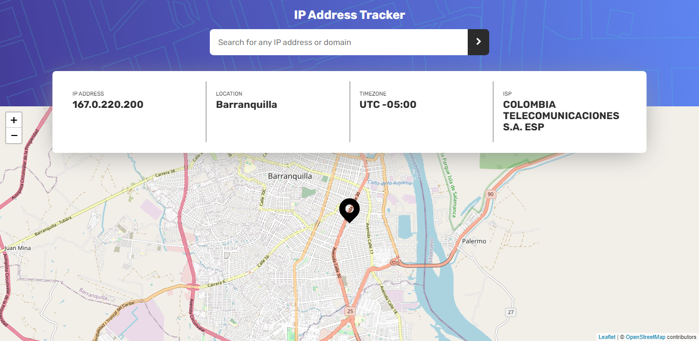

# Frontend Mentor - IP address tracker solution

This is a solution to the [IP address tracker challenge on Frontend Mentor](https://www.frontendmentor.io/challenges/ip-address-tracker-I8-0yYAH0). Frontend Mentor challenges help you improve your coding skills by building realistic projects.

## Table of contents

- [Overview](#overview)
  - [The challenge](#the-challenge)
  - [Screenshot](#screenshot)
  - [Links](#links)
- [My process](#my-process)
  - [Built with](#built-with)
  - [What I learned](#what-i-learned)
  - [Continued development](#continued-development)
  - [Useful resources](#useful-resources)
- [Author](#author)
- [Acknowledgments](#acknowledgments)

## Overview

### The challenge

Users should be able to:

- View the optimal layout for each page depending on their device's screen size
- See hover states for all interactive elements on the page
- See their own IP address on the map on the initial page load
- Search for any IP addresses or domains and see the key information and location

### Screenshot



### Links

- Solution URL: https://github.com/robertoms99/IP-address-tracker
- Live Site URL: https://ip-address-tracker-challenge.netlify.app/

## My process

### Built with

- Semantic HTML5 markup
- CSS custom properties
- Flexbox
- SASS
- Mobile-first workflow
- Vanilla JS
- ipify API
- LeafletJS API

### What I learned

In this challenge I learned to use 2 new api (LeafletJS and ipify)
and how to better manage my workflow. Each challenge has helped me improve my vision of how I can apply styles to my components.

Use custom attributes to better handle connecting elements with data:

```html
<span class="address__data" data-information-address> 127.0.0.1 </span>
```

I did a promisification of the send method of the XHR api (lately I feel that XHR is much more versatile and useful than the fetch api) :

```js
const originalSendMethod = window.XMLHttpRequest.prototype.send;
window.XMLHttpRequest.prototype.send = function (body) {
	const currentXHR = this;
	originalSendMethod.call(currentXHR, body);
	return new Promise((resolve, reject) => {
		currentXHR.addEventListener('load', () => {
			resolve(currentXHR.response);
		});
		currentXHR.addEventListener('error', () => {
			reject(new Error('Request Error'));
		});
	});
};
```

Don't modify native global objects at home haha:

```js
String.prototype.equals = function (stringToCompare) {
	return this === stringToCompare;
};
```

I helped myself with the Regex object for the ip validation:

```js
const ipRegex = /^((25[0-5]|2[0-4][0-9]|[01]?[0-9][0-9]?)\.){3}(25[0-5]|2[0-4][0-9]|[01]?[0-9][0-9]?)$/;
```

### Continued development

In these challenges I am striving to program functionally and neatly in javascript, and also apply my knowledge of responsive web design, however, my course is to analyze design patterns and architectures for js

## Author

- Website - :(
- Frontend Mentor - [@robertal99](https://www.frontendmentor.io/profile/robertal99/)
